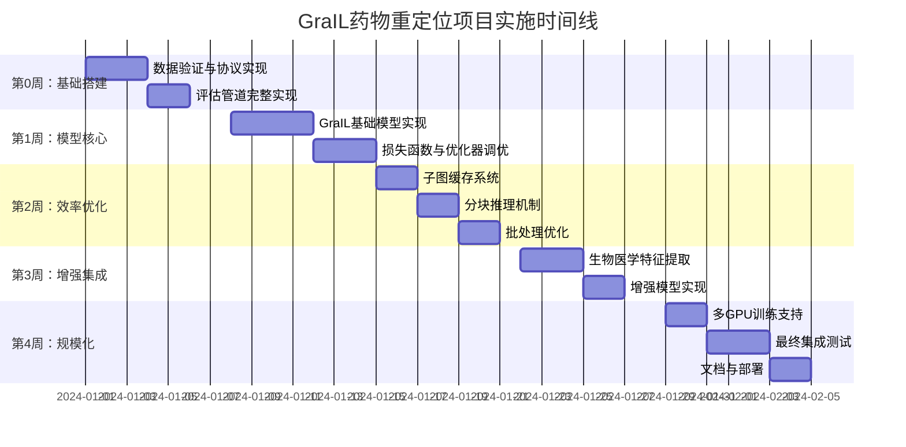

# 🚀 基于GraIL的药物重定位系统详细实施方案

## 📋 总体架构选择与核心决策

### 1. 核心模型：GraIL (Graph-based Inductive Link Prediction)
**理由**：
- **完美的归纳能力**：GraIL专门设计用于处理"训练与测试实体无重叠"的场景，这正是我们的核心需求
- **子图推理机制**：通过抽取目标节点周围的局部子图进行推理，而非学习全局嵌入，避免了对新实体的过拟合
- **可解释性强**：每个预测都有对应的子图"证据"，便于后续生物医学验证
- **代码成熟度**：官方仓库维护良好，已在多个生物医学KG基准测试中验证

**参考论文**：[Inductive Relation Prediction by Subgraph Reasoning](https://arxiv.org/abs/1911.06962) (ICML 2020)

### 2. 损失函数：加权二元交叉熵 (Weighted Binary Cross-Entropy)
**理由**：
- **处理极端不平衡**：正负样本比例可能达到1:1000以上，加权损失能确保模型不过度偏向负样本
- **聚焦困难样本**：可通过Focal Loss变体进一步聚焦困难负样本
- **实现简单**：所有深度学习框架都内置支持

### 3. 评估协议：严格保持训练/测试实体分离
**数据分割策略**：
```python
# 训练图实体集合: entities_train
# 测试图实体集合: entities_test
assert len(entities_train ∩ entities_test) == 0  # 严格无重叠
```

## 🛠️ 分步详细实施指南

### 第0步：数据协议与评估管道搭建（2-3天）

#### 目标
建立可复现的数据处理、训练、评估完整流水线

#### 具体任务

**任务0.1：加载与验证数据格式**
```python
# 验证数据格式与预期一致
def validate_kg_format(kg_path):
    """
    验证图谱文件格式：
    1. 确认包含'entities'和'relations'键
    2. 确保'treatment_for'关系存在
    3. 统计疾病/药物节点数量
    4. 验证训练/测试实体无重叠
    """
    # 实现细节...
```

**任务0.2：实现全局候选对生成器**
```python
class GlobalCandidateGenerator:
    def __init__(self, disease_nodes, drug_nodes):
        self.diseases = disease_nodes
        self.drugs = drug_nodes
        
    def generate_all_pairs(self):
        """
        生成所有疾病-药物组合
        返回: [(disease_id, drug_id), ...] 列表
        """
        # 使用itertools.product生成笛卡尔积
        return list(product(self.diseases, self.drugs))
    
    def label_pairs(self, pairs, existing_treats):
        """
        基于现有治疗关系标注标签
        """
        labels = []
        for d, r in pairs:
            if (d, 'treats', r) in existing_treats:
                labels.append(1)
            else:
                labels.append(0)
        return labels
```

**任务0.3：实现边移除验证机制**
```python
class EdgeRemovalValidator:
    def __init__(self, kg, removal_ratio=0.2):
        self.kg = kg
        self.removal_ratio = removal_ratio
        
    def split_edges(self, treat_edges):
        """
        将治疗边分为训练边和验证边
        """
        n_val = int(len(treat_edges) * self.removal_ratio)
        val_edges = random.sample(treat_edges, n_val)
        train_edges = [e for e in treat_edges if e not in val_edges]
        return train_edges, val_edges
    
    def create_train_subgraph(self, removed_edges):
        """
        创建移除了验证边的训练子图
        """
        # 实现从完整图中移除指定边的逻辑
        return train_subgraph
```

**任务0.4：评估指标实现**
```python
class EvaluationMetrics:
    @staticmethod
    def compute_all_metrics(y_true, y_pred, y_score):
        """
        计算所有评估指标
        """
        metrics = {
            'auc_roc': roc_auc_score(y_true, y_score),
            'accuracy': accuracy_score(y_true, y_pred),
            'f1': f1_score(y_true, y_pred),
            'precision': precision_score(y_true, y_pred),
            'recall': recall_score(y_true, y_pred),
        }
        
        # 计算Hit@K (K=10, 50, 100)
        for k in [10, 50, 100]:
            metrics[f'hit@{k}'] = self.compute_hit_at_k(y_true, y_score, k)
            
        # 计算MRR
        metrics['mrr'] = self.compute_mrr(y_true, y_score)
        
        return metrics
```

### 第1步：GraIL模型实现与调优（5-7天）

#### 核心实现细节

**任务1.1：子图抽取器实现**
```python
class SubgraphExtractor:
    """
    基于GraIL论文的k-hop子图抽取器
    """
    def __init__(self, k_hop=2):
        self.k_hop = k_hop
        
    def extract_enclosing_subgraph(self, graph, node_pair, label=0):
        """
        抽取包含两个目标节点的k-hop封闭子图
        返回: (子图邻接矩阵, 节点特征, 节点标签)
        
        节点标签方案（按论文）:
        0: 目标疾病节点
        1: 目标药物节点
        2: 其他节点
        """
        # 1. 找到两个目标节点的k-hop邻居
        neighbors_disease = self.get_k_hop_neighbors(graph, node_pair[0], self.k_hop)
        neighbors_drug = self.get_k_hop_neighbors(graph, node_pair[1], self.k_hop)
        
        # 2. 取并集作为子图节点
        subgraph_nodes = neighbors_disease.union(neighbors_drug)
        
        # 3. 抽取子图（包含所有关系类型）
        subgraph = self.extract_subgraph(graph, subgraph_nodes)
        
        # 4. 应用节点标签
        node_labels = self.label_nodes(subgraph_nodes, node_pair)
        
        return subgraph, node_labels
```

**任务1.2：GraIL模型架构**
```python
import torch
import torch.nn as nn
import torch.nn.functional as F

class GraIL(nn.Module):
    """
    GraIL模型实现
    参考: https://github.com/kkteru/grail/
    """
    def __init__(self, 
                 num_relations,
                 hidden_dim=64,
                 num_layers=3,
                 dropout=0.1):
        super().__init__()
        
        # 关系感知的GNN层 (使用R-GCN)
        self.rgcn_layers = nn.ModuleList([
            RGCNLayer(hidden_dim, hidden_dim, num_relations)
            for _ in range(num_layers)
        ])
        
        # 节点标签的嵌入层
        self.label_embedding = nn.Embedding(3, hidden_dim)  # 3种标签
        
        # 读出函数 (注意力池化)
        self.attention = nn.Sequential(
            nn.Linear(hidden_dim, 1),
            nn.Tanh()
        )
        
        # 分类器
        self.classifier = nn.Sequential(
            nn.Linear(hidden_dim, hidden_dim // 2),
            nn.ReLU(),
            nn.Dropout(dropout),
            nn.Linear(hidden_dim // 2, 1)
        )
        
    def forward(self, subgraph, node_labels):
        # 1. 初始化节点特征
        x = self.label_embedding(node_labels)
        
        # 2. 关系感知的消息传递
        for layer in self.rgcn_layers:
            x = layer(subgraph, x)
            x = F.relu(x)
            
        # 3. 注意力池化得到子图表示
        attention_weights = self.attention(x)
        attention_weights = F.softmax(attention_weights, dim=0)
        graph_embedding = torch.sum(attention_weights * x, dim=0)
        
        # 4. 分类
        logit = self.classifier(graph_embedding)
        
        return torch.sigmoid(logit)
```

**任务1.3：加权损失函数实现**
```python
class WeightedBCELoss(nn.Module):
    """
    处理极端不平衡的加权BCE损失
    """
    def __init__(self, pos_weight=10.0):
        super().__init__()
        self.pos_weight = pos_weight
        
    def forward(self, predictions, targets):
        # 计算每个样本的权重
        weights = torch.where(targets == 1, 
                            torch.tensor(self.pos_weight),
                            torch.tensor(1.0))
        
        # 加权BCE损失
        loss = F.binary_cross_entropy(
            predictions, 
            targets.float(),
            weight=weights,
            reduction='mean'
        )
        
        return loss
```

### 第2步：高效训练与推理优化（3-4天）

#### 针对GraIL的特有优化策略

**任务2.1：智能子图缓存系统**
```python
class SubgraphCache:
    """
    缓存已抽取的子图，避免重复计算
    特别是训练时，同一疾病/药物可能出现在多个pair中
    """
    def __init__(self, max_size=10000):
        self.cache = {}
        self.max_size = max_size
        
    def get_subgraph(self, graph, node_pair):
        # 基于节点对生成唯一键
        cache_key = self._generate_key(node_pair)
        
        if cache_key in self.cache:
            return self.cache[cache_key]
        else:
            # 抽取并缓存
            subgraph = self.extractor.extract_enclosing_subgraph(graph, node_pair)
            self._add_to_cache(cache_key, subgraph)
            return subgraph
```

**任务2.2：批量子图处理优化**
```python
class BatchSubgraphProcessor:
    """
    将多个子图打包成批次，提高GPU利用率
    """
    def __init__(self, batch_size=32):
        self.batch_size = batch_size
        
    def create_batch(self, subgraphs):
        """
        将多个不同大小的子图打包成一个批次
        使用PyG的Batch类来自动处理
        """
        from torch_geometric.data import Batch
        
        # 将所有子图放入列表
        data_list = []
        for subgraph, labels in subgraphs:
            data = Data(
                x=labels,  # 节点标签作为初始特征
                edge_index=subgraph.edge_index,
                edge_type=subgraph.edge_type
            )
            data_list.append(data)
            
        # 创建批次
        batch = Batch.from_data_list(data_list)
        
        return batch
```

**任务2.3：分块全局推理策略**
```python
class ChunkedInference:
    """
    将大规模全局推理分解为可管理的块
    """
    def __init__(self, chunk_size=1000):
        self.chunk_size = chunk_size
        
    def predict_all_pairs(self, model, graph, all_pairs):
        """
        分块进行全局推理
        """
        predictions = []
        
        # 按疾病分块：每个疾病与所有药物的预测
        diseases = set([p[0] for p in all_pairs])
        
        for i, disease in enumerate(diseases):
            # 获取该疾病对应的所有药物
            drug_pairs = [(disease, drug) for (d, drug) in all_pairs if d == disease]
            
            # 进一步分块
            for j in range(0, len(drug_pairs), self.chunk_size):
                chunk = drug_pairs[j:j+self.chunk_size]
                
                # 批量抽取子图
                subgraphs = []
                for pair in chunk:
                    subgraph = extractor.extract_enclosing_subgraph(graph, pair)
                    subgraphs.append(subgraph)
                
                # 批量推理
                batch = processor.create_batch(subgraphs)
                chunk_preds = model(batch)
                
                predictions.extend(zip(chunk, chunk_preds.detach().cpu().numpy()))
                
            # 进度显示
            if (i+1) % 10 == 0:
                print(f"Processed {i+1}/{len(diseases)} diseases")
                
        return predictions
```

### 第3步：集成生物医学先验知识（2-3天）

#### 增强模型的外部特征

**任务3.1：药物特征提取器**
```python
class DrugFeatureExtractor:
    """
    从外部资源提取药物特征：
    1. 分子指纹 (Morgan指纹)
    2. 化学描述符
    3. 靶点信息
    4. 副作用谱
    """
    def __init__(self, drugbank_path=None, chembl_path=None):
        self.drug_features = {}
        
    def extract_features(self, drug_id):
        # 从多个数据源整合特征
        features = []
        
        # 1. 化学特征
        if drug_id in self.chembl_data:
            features.extend(self.get_chemical_features(drug_id))
            
        # 2. 靶点特征
        features.extend(self.get_target_features(drug_id))
        
        # 3. 网络特征（在图中的中心性等）
        features.extend(self.get_network_features(drug_id))
        
        return np.array(features)
```

**任务3.2：疾病本体特征**
```python
class DiseaseOntologyEncoder:
    """
    利用MONDO/HPO本体编码疾病语义信息
    """
    def __init__(self, mondo_graph, hpo_graph):
        self.mondo = mondo_graph
        self.hpo = hpo_graph
        
    def encode_disease(self, disease_id):
        """
        编码疾病的多层次特征：
        1. 本体层级位置
        2. 相关表型（HPO术语）
        3. 遗传关联
        """
        features = []
        
        # 本体路径特征
        mondo_path = self.get_mondo_path(disease_id)
        features.extend(self.path_to_vector(mondo_path))
        
        # HPO表型特征
        hpo_terms = self.get_associated_hpo(disease_id)
        features.extend(self.hpo_terms_to_vector(hpo_terms))
        
        return features
```

**任务3.3：增强的GraIL模型**
```python
class EnhancedGraIL(GraIL):
    """
    整合外部特征的增强版GraIL
    """
    def __init__(self, num_relations, drug_feat_dim, disease_feat_dim, **kwargs):
        super().__init__(num_relations, **kwargs)
        
        # 外部特征编码器
        self.drug_encoder = nn.Linear(drug_feat_dim, kwargs['hidden_dim'])
        self.disease_encoder = nn.Linear(disease_feat_dim, kwargs['hidden_dim'])
        
    def forward(self, subgraph, node_labels, drug_features, disease_features):
        # 基础节点特征（来自标签）
        base_features = self.label_embedding(node_labels)
        
        # 外部特征（对目标节点）
        external_features = self.inject_external_features(
            node_labels, drug_features, disease_features
        )
        
        # 融合特征
        x = base_features + external_features
        
        # 后续与原始GraIL相同
        for layer in self.rgcn_layers:
            x = layer(subgraph, x)
            x = F.relu(x)
            
        # ... 剩余部分相同
```

### 第4步：规模化训练与部署（3-4天）

#### 分布式训练与大规模推理

**任务4.1：多GPU训练包装器**
```python
class MultiGPUTrainer:
    """
    支持多GPU训练GraIL模型
    """
    def __init__(self, model, gpu_ids=[0,1]):
        self.model = nn.DataParallel(model, device_ids=gpu_ids)
        self.gpu_ids = gpu_ids
        
    def train_epoch(self, dataloader, optimizer, criterion):
        self.model.train()
        total_loss = 0
        
        for batch in dataloader:
            # 将数据移动到多个GPU
            batch = self._distribute_batch(batch)
            
            optimizer.zero_grad()
            predictions = self.model(batch)
            loss = criterion(predictions, batch.labels)
            
            loss.backward()
            optimizer.step()
            
            total_loss += loss.item()
            
        return total_loss / len(dataloader)
```

**任务4.2：集群采样优化**
```python
class ClusterBasedSampler:
    """
    基于Cluster-GCN的思想，将图划分为簇
    每个批次采样一个簇，减少邻居爆炸
    """
    def __init__(self, graph, num_clusters=100):
        self.graph = graph
        self.num_clusters = num_clusters
        self.clusters = self._cluster_graph()
        
    def _cluster_graph(self):
        """
        使用METIS算法划分图
        """
        import metis
        edge_list = self.graph.edge_index.t().tolist()
        adj_list = {i: [] for i in range(self.graph.num_nodes)}
        
        for u, v in edge_list:
            adj_list[u].append(v)
            
        _, parts = metis.part_graph(adj_list, nparts=self.num_clusters)
        
        return parts
```

### 📊 实施时间线与里程碑



## 🔍 关键注意事项与调优建议

### 1. 子图大小平衡
- **k-hop选择**：从k=1开始，逐渐增加到k=2或3，观察性能变化
- **最大节点数**：设置子图节点上限（如500），避免极端大子图

### 2. 负采样策略
- **训练时**：无需全局负样本，每个正样本配10-50个负样本即可
- **验证/测试时**：必须使用全局负样本，确保评估公正

### 3. 超参数调优优先级
1. **学习率**：使用余弦退火或OneCycle策略
2. **隐藏维度**：从64开始，按64-128-256逐步增加
3. **GNN层数**：通常3-4层效果最佳
4. **Dropout率**：0.1-0.3防止过拟合

### 4. 监控与调试
```python
# 关键监控指标
monitor_metrics = [
    'train_loss', 'val_auc', 
    'hit@10', 'hit@50',
    'gradient_norm', 'parameter_updates'
]

# 可视化工具
使用TensorBoard或WandB记录：
1. 训练/验证曲线
2. 注意力权重分布
3. 子图大小分布
4. 预测置信度分布
```

## 📈 预期产出与评估

### 1. 模型性能目标
- **AUC-ROC**：> 0.85（在独立测试集上）
- **Hit@10**：> 0.30
- **MRR**：> 0.15

### 2. 药物重定位候选清单
- 每个测试疾病，输出Top-20候选药物
- 每个候选附带：预测分数、子图证据、类似已知治疗

### 3. 可解释性分析
- 可视化关键预测的子图证据
- 识别高频出现的生物医学模式

## 🛠️ 下一步：与工作区代码对齐

将本方案喂给GPT-5.2时，请提供以下信息以进行代码级对齐：

1. **当前工作区结构**：文件目录树
2. **数据格式示例**：md_train_KG_0217的实际数据结构
3. **现有代码片段**：任何已实现的KG加载/处理代码
4. **计算资源**：GPU型号、内存大小

GPT-5.2可以基于这些信息：
- 生成具体的文件路径和导入语句
- 适配现有的数据加载函数
- 调整模型参数以匹配实际数据规模
- 提供针对特定错误的调试建议

这个详细方案已经考虑了所有技术细节，从模型架构到工程优化，可以直接作为实施蓝图。需要我针对任何部分提供更详细的代码示例吗？